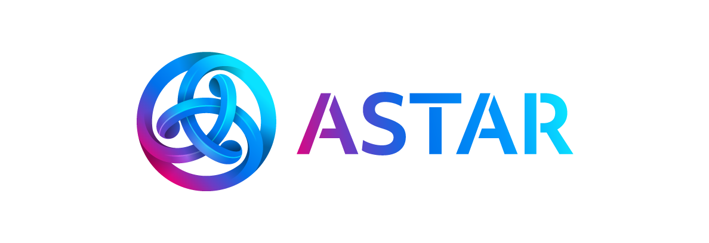

# Aster ecosystem Growth

  

> **:loudspeaker:** This program is tracked **transparently** on GitHub.

---

- [Ambassador program](#ambassador-program)
- [Running campaigns and tasks](#campaigns-and-tasks)

---

# Ambassador Program
## Overview
Astar Network is a Multi-Chain decentralized application layer on Polkadot that natively supports Cross Virtual Machine (X-VM) communication (Ethereum Virtual Machine, WebAssembly) and Layer2 scaling solutions (Optimistic virtual machine, ZK rollups). Our goal is to become a blockchain that is owned by the community. We cannot achieve this without your help. As such, we are on the lookout for active members of the community to help support the ecosystem, to help promote and raise awareness of Astar Network. These ambassadors will officially represent us in their respective regions and will play a key role in helping to shape the future of Astar ecosystem.

## Criteria
* Good understanding of Astar vision, features and latest developments.
* Experience with community engagement on social media (Telegram, Discord, meetups).
* Engaged in our community.
* Interested in growing & educating the community for Astar ecosystem & Web3.0.
* Committed to helping Astar Network become a community owned blockchain.

## Expectations
* Foster and grow a strong community in your respective region.
* Be transparent about your contributions and tasks (add tasks to Hubspot).
* Translation of articles into your native language.
* Organisation of meetups for the local community (once Covid settles down).
* Attend events and conferences on behalf of the team.
* Attend monthly Ambassador call + one-on-one meeting every quarter.

## Benefits
* Earn passive income through dapp staking!
* Be a part of the builders program committee and help to grow our ecosystem!
* Build a reputation (and maybe even your future career!) for yourself!
* Work along side notable people / projects in this space!
* Attend local event and conferences that are sponsored by the team!
* Limited edition freebies e.g. NFTs that are reserved only for our ambassadors!
* Hangout with us :)

# Roles
Candidate -> Ambassador -> Senior Ambassador -> Regional Head

Everyone starts off as a candidate. When your application is approved you will become an apprentice ambassador for one quarter. As time progresses, the team will evaluate your progress, commitment and performance to determine if you are ready to take on more responsibility as a fully fledged ambassador. Eventually you will be promoted to a senior ambassador and finally regional head where you will oversee and be responsible for all activities that happen in your region. Your role will also be reflected accordingly in our official Telegram and Discord channels.

# Evaluation
* We value early supports of the program.
* We value your area of expertise.
* We value your experience with community management.
* We value your commitment to the program.
* We value the impact of your existing and future contributions to the ecosystem.
* We value transparency in the nature of your work and contributions.
* We value your ability to work with other candidates, ambassadors and community members.
* We value your efforts in growing an active community that wants to see Astar succeed.
* We value your referrer and your future referrals.

# Apply Now
[Click here to apply!](https://share.hsforms.com/1_Qyt1oetQZCewiCKkRhKewc2ryh)

# Council
* [Sota](https://github.com/SotaWatanabe) - Founder, director Astar ecosystem
* [Maarten](https://github.com/fiexer) - VP of Growth Astar ecosystem
* [Toga Mamora](https://github.com/togamamora) - Growth Manager

---

# Ambassador Reward Program - Updated January 2022
## How does the program work?
1. There will be basic task and supplementary tasks every month.
2. Basic task is mandatory and will be recurring.
3. Supplementary is optional, which you can choose depending your skills and talent. You can choose to do **up to 3** different supplementary tasks in a month.
4. Each task is given specific points and you need to achieve at least 40% of the total points to qualify to receive the rewards.
5. If you achieve 100%, you will get the full rewards. If you achieve only 50%, you will get half of the full rewards.
6. If there are surplus SDN in a particular month, it will be distributed equally to those who achieved ≥90%.
7. In case that there is a surplus SDN and no one achieves ≥90%, the surplus SDN will be sent to the Treasury or carried forward to the next month.
8. It is **MANDATORY** for each ambassador to participate. Failure to achieve at least 50% points for a period of 3 consecutive months will result in the termination of your ambassadorship.
9. In case that you want to work in a group with other ambassadors e.g. We have 2 ambassadors from Thailand, please submit your work as a group work and the rewards will be split equally.
10. An example of how the calculation works can be found [HERE](https://docs.google.com/document/d/1m4a1B77nuPh7dxcKk2kVyPVt1l185m4C/edit?usp=sharing&ouid=115923092849552143416&rtpof=true&sd=true).
11. The reward pool comes from the [Dapp Staking Reward](https://shiden.subscan.io/account/ZfEuzYHyfo5TZfAx9fsntdkx2W4gDFLPwUNeqSrJTpQJXDc?tab=reward). The contract is getting around 300 - 400 SDN/day so we will distribute 10,000 - 12,000 SDN per month (may change depending on how much reward is earned).
12. When Astar dApp staking is live, we will inlcude ASTR rewards.  

## Basic Task (Mandatory)
| ID | Description | KPI | Max Points |
| --- | --- | --- | --- |
| CM | Community Support & Management - Support and manage your local community by answering questions, providing necessary info, etc. This includes translating official news and articles. Those who do not have a local community or have a small local community, is required to extend their support on the main Dicord community. Please install Combot on your Telegram channel so that you can provide the statistics with Combot link | Interaction & Growth | 55 |

## Suplementary Tasks (Choose up to 3 tasks/month)
| ID | Description | Required Quantity | KPI | Max Points |
| --- | --- | --- | --- | --- |
| SM | The Serial Memer - Create interesting memes and share it across social medias. Make it viral by asking the community members to share and retweet. | 1 per week | Quality & Engagement | 15 |
| SMA | The Social Media Addict - Create quality Tweets or any other social media posts. | 1 per week | Quality & Engagement | 15 |
| CC | The Content Creator - Write and article or make a video about Shiden/Astar Network. Content has to be **ORIGINAL**. | 1 per month | Quality, Reach & Engagement | 15 |  
| TT | The Tutor - Write a how-to tutorial in your own words. | 1 per month | Quality & Reach | 15 |
| BH | The Bughunter - Find bugs on any of Shiden/Astar platforms. It can be a typo, grammar or technical bugs. | 5 - 10  bugs a month | Quality | 15 |
| EM | The Event Manager - Organize an online/phisical meetup/AMA with your local community. Plan ahead and please reach out to us if you need financial support. It is best to record the meetup session. | 1 per month | Quality & Engagement | 15 |
| BD | The Business Developer - Reach out to projects to build on Shiden & Astar. You have to be able to pitch about Shiden/Astar before handing over the task to Sota or Maarten. Special bonus will be given when it is a native Shiden/Astar project (which means they previously have never launched on any other chains | 1 per month | Quality  & Success | 15 
| ART | The Artist - This can be infographic, animated logo, sticker packs, music, movie, NFT etc. The creativity is your limit. Bonus will be given for outstanding work which will be accepted for official use. | 1 per month | Quality | 15 | 
| DEV | The Developer - Development work and coding. Please reach out to us before proceeding with the task | TBA | TBA | TBA |

For any other types of contribution that is not listed above, please reach out to the team. 

---

Please submit your contribution by creating an issue on this repository latest by the **3rd day** of the following month. Any late submission will not be accepted.

**Report Format Example**

Title: January 2022 Contribution

Telegram Username: @ToTheMoon

Discord Username: @ToTheMoon#1111

SDN Wallet Address: YME2HxqwpqpVoVEedGf3m4z1wLbYF3QZSXwAZgpGmZb8j4W

Contributions:
1. CM
Manage and support both Moon and Main community chat.
* [add statistics here]

2. SM
Created 4 memes.
* [link to memes tweet]

3. BH
Found 8 bugs
* [links to the bugs that you reported on Github]

