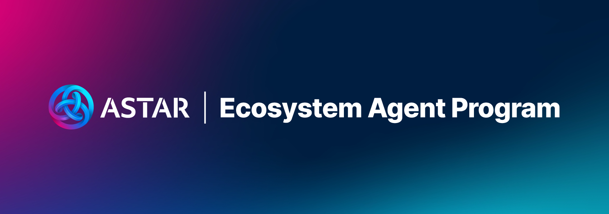

# Astar Ecosystem Agent Program

  

> **:loudspeaker:** This program is tracked **transparently** on GitHub.

---

# Agent Program

## Overview
[Astar Network](https://astar.network/) – the Innovation Hub on Ethereum and Polkadot.

Astar Network connects you to web3. It is the gateway for projects across enterprises, entertainment & gaming in Japan and beyond, driving global adoption and delivering web3 to billions. Astar leverages a multi-layered tech stack powered by Polygon and Polkadot to offer customizable blockchain solutions that accelerate web3 adoption. With zk-powered Ethereum L2 Scaling (zkEVM), EVM, WASM, and a cutting-edge ecosystem, Astar delivers robust, secure, and interoperable web3 technology.

Astar envisions a future where the possibilities of web3 empower billions of individuals and enterprises. Our mission is to bring the potential of web3 to the forefront of billions.

Guided by our core values and technology pillars, we strive to create a world that is not merely driven by technology for technology's sake. Instead, we are committed to harnessing the power of technology, particularly decentralized systems, to improve the world and uplift communities.

# Goal & Responsibilities

Cultivate a vibrant and engaged community that actively contributes to the growth and success of Astar network by fostering education, encouraging adoption, and building meaningful connections within the blockchain ecosystem. The program aims to turn agents into influential advocates, educators, and facilitators, ensuring the sustainable development and decentralization of the Astar network.

Open to all, the program welcomes developers, investors, beginners, cryptocurrency experts, content creators, event organizers, and more. The main requirement is to channel your passion and skills to support Astar Network and help the community's vibrant ecosystem.

## Criteria
* Good understanding of Astar vision, features and latest developments.
* Experience with community engagement on social media (Telegram, Discord, meetups).
* Engaged in our community.
* Interested in growing & educating the community for Astar ecosystem & Web3.0.
* Committed to helping Astar Network become a community owned blockchain.

## Expectations
* Foster and grow a strong community in your respective region.
* Be transparent about your contributions and tasks.
* Translation of articles into your native language.
* Organisation of meetups for the local community.
* Attend events and conferences on behalf of the team.
* Attend monthly Agent call.

## Benefits
* Gain recognition as a representative of the Astar Network.
* Enjoy privileged access to the core team, providing insights and the latest news.
* Contribute to and be a part of the governance council, actively shaping our growing ecosystem.
* Be a part of the governance council and help to grow our ecosystem!
* Develop a strong reputation within the program, potentially influencing your future career path.
* Collaborate with notable individuals and projects in the blockchain space.
* Receive recognition and showcase your contributions through Astar channels and the TBA.
* Earn passive income through dApp staking within the incentive system.
* Receive invitations to local events and conferences sponsored by the Astar team.
* Be an early adopter of the technology.
* Limited edition freebies e.g. NFTs that are reserved only for our agents!
* Hangout with us :)

# ⚖️ Code of Conduct

Being an agent means being officially recognized as a representative of the Astar Network and its ecosystem. This role carries a responsibility to uphold the Astar name and its values.

Before joining the agent program, members must thoroughly read, understand, and respect the Astar Space Club: Code of Conduct. This is crucial for fostering an environment of collaboration, learning, and trust.

### Respect:

- **Be Respectful:** Treat all members with respect, fostering a welcoming environment that embraces diversity and promotes courteous interactions.
- **Help others:** Willingly offer assistance, share knowledge, and encourage collaboration to empower fellow community members.
- **Be constructive:** Positively contribute to discussions and projects by providing well-reasoned feedback, seeking solutions, and making meaningful contributions.
- **Speak your mind:** Express your thoughts openly and respectfully, fostering open and honest communication to drive positive change.
- **Share Feedback:** Provide constructive feedback and be open to receiving it, promoting a culture of continuous improvement and appreciation.
- **Act exemplary:** Lead by example, upholding the highest ethical standards, inspiring trust, and supporting the community's vision with integrity and credibility.
- **Social identity:** As representatives of Astar, agents are expected to uphold the reputation of the project through their social identity, ensuring responsible use of their accounts by avoiding heavy engagement farming and refraining from excessive promotion of competitor products.

### Avoid:

- **No Impersonation:** Do not impersonate or falsely represent yourself as another individual or organization, especially Astar Network brand or any entity within the community.
- **No self-promotion:** Avoid excessive self-promotion, personal projects, or spamming within Astar's channels that could detract from the quality and purpose of the community.
- **No Harassment or Hate Speech:** Refrain from engaging in any form of harassment or hate speech, ensuring a safe and inclusive environment for all community members.
- **No Plagiarism:** Do not present someone else's work, ideas, or content as your own without proper attribution or permission.
- **No Astar’s price talk:** Avoid excessive discussion or speculation regarding Astar's price or investment-related topics, as these may not align with the community's focus and objectives.

If you are a member of the Agent program, consider it a privilege to represent Astar, and therefore, it is expected that you demonstrate exemplary behavior when engaging with the community and partners.

Violating this code of conduct may lead to warnings or permanent bans from the Astar Agent Program, taking into account the seriousness and frequency of the transgression. The Community Growth Team holds ultimate authority in upholding these guidelines and will take necessary measures to preserve a positive and trustworthy community atmosphere.

**Shine Like A Star 🌠**

# The Agents
You can find the list of Agents [HERE](https://github.com/AstarNetwork/growth-program/blob/main/agent-list.md).

## There are 2 different programs that we offer
1. **Ecosystem Agent Program**: For non-technical community members. See [HERE](https://github.com/AstarNetwork/growth-program/blob/main/ecosystem-agent-program.md). 
2. **Technical Agent Program**: For technical community members. See [HERE](https://github.com/AstarNetwork/growth-program/blob/main/technical-agent-program.md).

## Other programs which the Agents can participate on
1. UI DAO. See [HERE](https://github.com/AstarNetwork/growth-program/blob/main/ui-dao.md)
2. UI Tester DAO. See [HERE](https://github.com/AstarNetwork/growth-program/blob/main/ui-tester-dao.md)

# Evaluation
* We value early supports of the program.
* We value your area of expertise.
* We value your experience with community management.
* We value your commitment to the program.
* We value the impact of your existing and future contributions to the ecosystem.
* We value transparency in the nature of your work and contributions.
* We value your ability to work with other candidates, agents and community members.
* We value your efforts in growing an active community that wants to see Astar succeed.
* We value your referrer and your future referrals.

---
Updated on the 17th June 2024